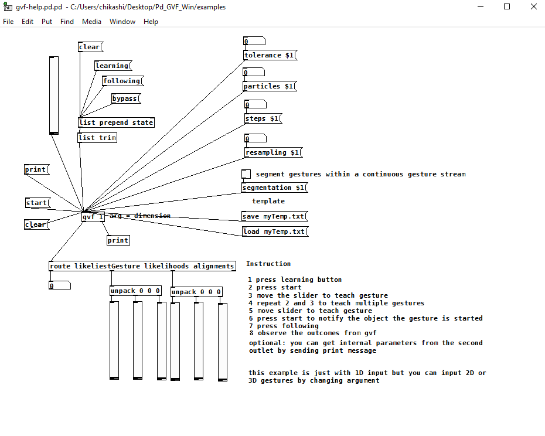

## GVF Pd object for windows
A pure data external object of GVF (Gesture Variation Follower)

- Developed by [Dr. Chikashi Miyama](http://chikashi.net)
- based on the [GVF algorithm](https://github.com/bcaramiaux/ofxGVF) by [Baptiste Caramiaux](http://www.baptistecaramiaux.com/), using [flext](https://github.com/grrrr/flext) by [Thomas Grill](https://grrrr.org/) .

## how to use
You will find in bin directory gvf.dll
copy this .dll to the directory of your own patch
